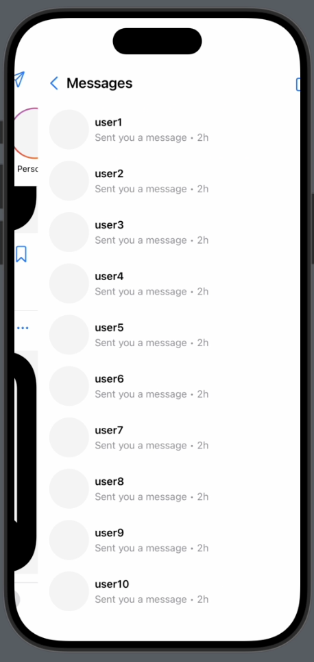
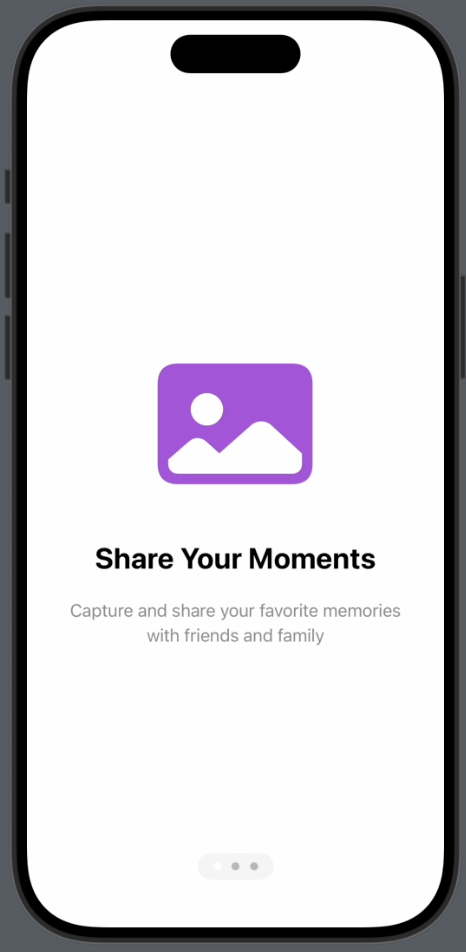
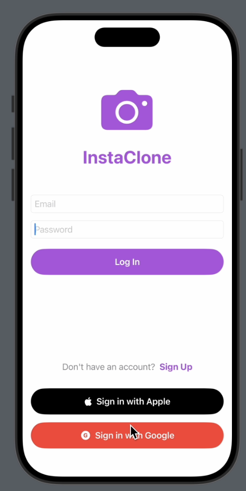
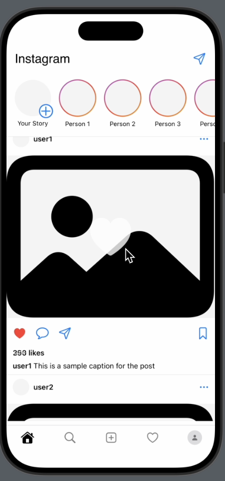

# Instaclone

A simple Instagram clone built with native SwiftUI without using any third-party libraries.

## Features
- login with email and password
- login with google button
- login with apple button
- register with email and password
- reset password
- double tap to like a post
- send message to another user
- view all users
- view all posts
- view all comments
- swipe to see messages

## Screenshots

## Installation

1. Clone the repository with xcode
2. Run the app
